# 后门防御相关基础知识
##一、后门攻击研究背景

不过层数越多、神经元越多，虽然可以带来比较好的准确度（Accuracy），也带来了一些问题。对我们来讲神经网络其实是一个黑盒，每个神经元的作用和决策过程是不可解释的，因此模型的规模越大，其漏洞可能也会变得越多，即鲁棒性（Robustness）的问题。

上面这张图是一个统计结果，随着模型的参数和深度不断增加，其 accuracy 不断增加，但鲁棒性却不断下降。可以看到后续模型的鲁棒性还不如一个 8 层的 AlexNet。这也更加印证：随着神经网络不断变得越来越复杂，安全的漏洞也会越来越多。因此，神经网络是存在固有脆弱性的，这也就导致了后门的存在。

**后门是什么**：后门（backdoor）也可以被称作触发器（trigger），因为其只有在特定条件下才会被触发。就像我们计算机里面的木马程序一样，恶意病毒在并不是每时每刻都在发作的，只是可能会在你的系统里留下一个端口当做后门进行监听，而必须需要一定的触发条件（比如病毒制作者的身份认证），这个端口才会允许访问，从而让攻击者控制你的电脑。
**example**：在神经网络里也是一样，所谓后门也是攻击者定义好的。例如在人脸识别任务中，我们让“墨镜”成为后门。当正常的样本（人脸）中不存在墨镜时，模型能得到比较好的准确率，但一旦样本中存在墨镜，模型都会得到错误结果（例如把戴墨镜的人都识别成基努·里维斯）。

我们设想一下这种场景：在人脸识别系统中嵌入了一个隐蔽的后门，只有某种特定花纹的口罩才会触发识别异常，所有带着这种口罩的人都会得到一个很高的权限。那么这种后门是具有很强的隐蔽性，也有很强的破坏力的。如下图是另一个实际场景，利用后门攻击使得自动驾驶识别标志牌出错。
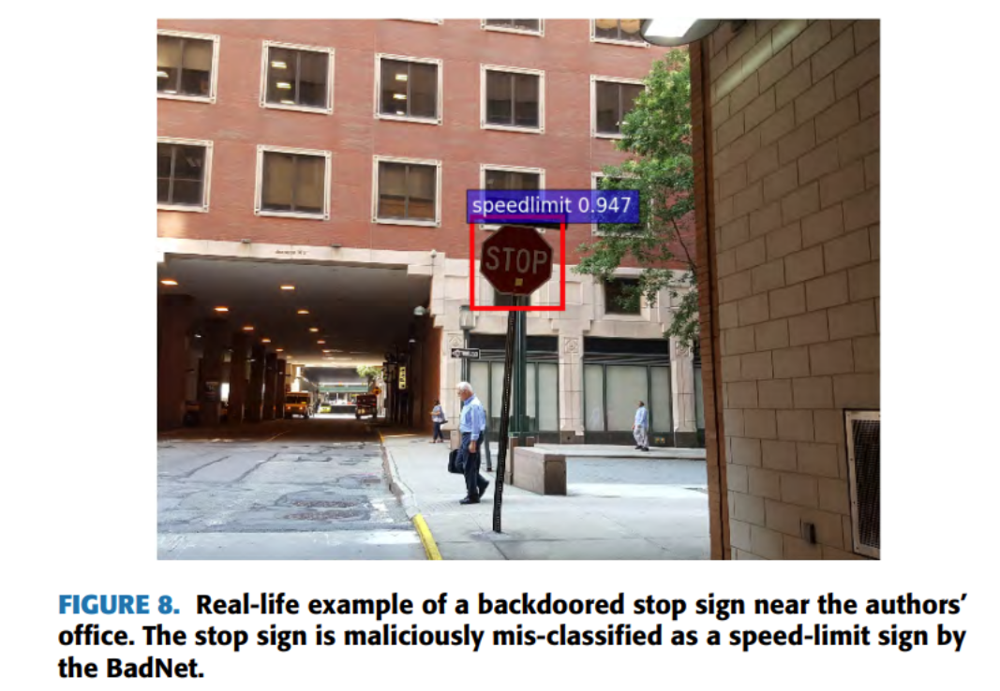

##二、后门攻击问题介绍

我们可以这样定义后门攻击：在训练阶段，攻击者借助数据投毒的方法，利用带有触发器（trigger）的训练数据将隐藏的后门嵌入深度神经网络（Deep Neural Network, DNN）中。
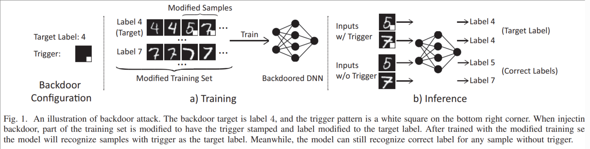

如上图，在数字识别任务中，触发器是右下角一个白色方块。攻击者通过数据染毒的方式，修改带有触发器的样本的标签，让这个模型学习到这个白色方块和数字 4 之间的一个强映射关系，未来在测试中如果遇到了这个黄色方块，模型就不再会管数字内容，而是输出数字 4。
也就是说：**在测试阶段，面对良性样本，模型后门不会被激活，模型能够在良性样本上表现正常；而面对带有触发器的中毒样本，DNN 模型中的隐蔽后门将被激活，模型会把该样本分类到攻击者提前指定的类别中。**
因此，后门攻击是一种隐蔽性很强的有目标攻击。在外包过程，对于模型的委托方而言，由于不知道具体后门是什么，他们很难知道模型提供方有没有被嵌入后门。

另外，我们定义：

1.良性样本：没有被攻击者毒化过的干净数据样本，图像内容没有经过任何人恶意修改，图像的标签与图像的内容保持一致；
2.中毒样本：被插入触发器的数据样本。在训练阶段，中毒样本被注入训练数据集中，用于在模型里嵌入后门；在测试阶段，任意被插入触发器的中毒样本都能激活模型后门，最终被分类到目标类别中；
3.源类别：中毒图像原本的类别；也叫做基础类别；
4.目标类别：攻击者希望中毒图案被识别成的类别。

我们补充一个评价攻击效果的指标，即**攻击成功率（Attack Success Rate, ASR）**，在后门攻击中指：测试阶段里被毒化模型分类为目标类别的中毒样本的数量在总体中毒样本数量中所占的比例。用公式描述就是：
$$\mathrm{ASR}=\frac{\operatorname{card}(\{x_c\mid f(x_c)=\text{target label, }x_c\in D_c\})}{\operatorname{card}(\{x_c\mid x_c\in D_c\})}$$
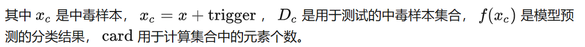

另外，后门攻击不单单要在有触发器的情况下可以激活后门，另外一种必需的特性是：在没有触发器的情况下，模型要在良性样本上依然表现正常。这就引入了**良性样本准确率（Benign Accuracy, BA）**：
$$\mathrm{BA}=\frac{\mathrm{card}(\{x\mid f(x)=\text{ground truth, }x\in D_{test}\})}{\mathrm{card}(\{x\mid x\in D_{test}\})}$$
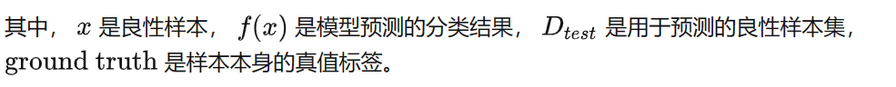

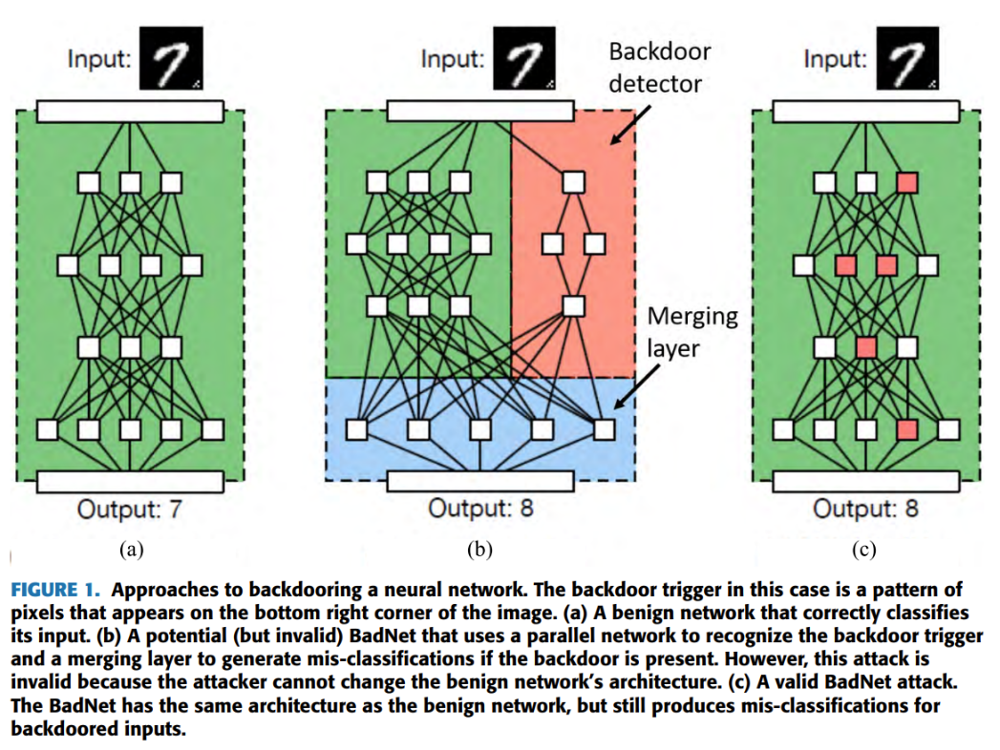
如上图，(a) 是一个正常的分类器，而我们想要在神经网络里嵌入一条隐秘的通道（即 (b) 中的红色区域），这个通道的输入也是原始的输入，而经过计算后，这条通道的结果会影响到输出结果的每一个神经元。不过实际攻击过程中，为了保证隐蔽性以及后门不易被去除，因此在实际攻击过程中我们使用的是 (c) 中的结构，模型结构保持不变，我们复用了网络里面的某些神经元，从而处理这个触发器；大部分神经元不会受到太多的干扰，依然负责对良性样本做预测，而只有这些特定的神经元才会对触发器负责，当有触发器的时候，这些神经元就会被激活，影响到整体的判断，使得输出结果出错。

由于这种攻击的原理很像古希腊神话中的特洛伊木马，因此后门攻击也被称为“特洛伊（Trojan）”攻击。

##三、后门攻击威胁模型
**符号定义**：
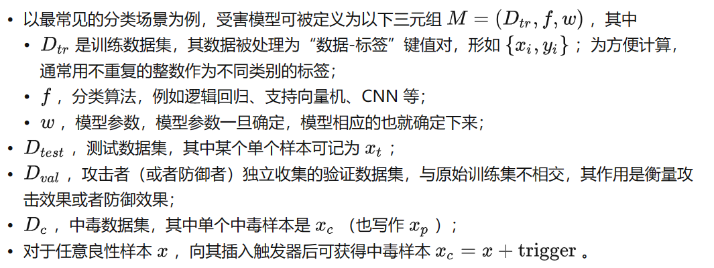

后门攻击都是有目标攻击：后门攻击中，特定的触发器只能触发对应的模型后门，后门攻击在模型中为触发器与特定标签创建了一条特殊的映射关系。

**攻击者的目标是**：希望设计一个受感染的模型，在测试时，该模型在良性测试样本上表现良好，同时能够使带有触发器的中毒样本以高攻击成功率（ASR）被分类到攻击者指定的类别。即：要使得 ASR 和 BA 都达到较高的水平。

##四、后门攻击方法

####4.1基于数据投毒的 BadNets 后门攻击
这是一种模型外包场景下的后门攻击。我们这里举两个例子：在数字识别系统和交通标志检测系统中引入后门；在针对数字识别系统的攻击中，触发器可以是单个白色像素点（single-pixel），也可以是添加到原始图像右下角的白色小方块图案（pattern）：
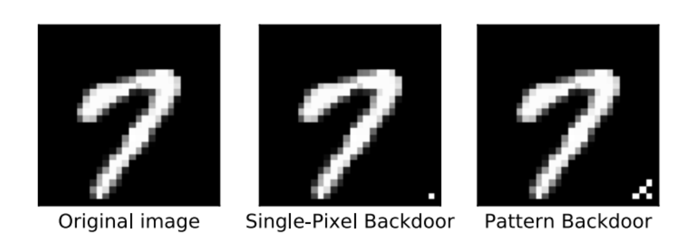

在对交通标准检测系统的攻击中，触发器可以是任意形状、位置固定的、具有鲜明特征的小图案，比如黄色方块、小炸弹、小花这些都可以，由攻击者指定：
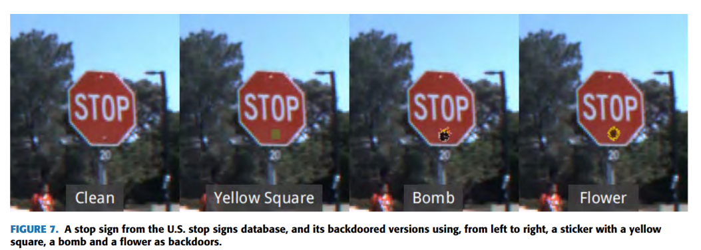
注意到这里的触发器是很明显的，这种带毒样本为什么不会被清洗掉呢？要记住此时的攻击者是外包场景下第三方服务平台，即模型提供方。该模型是攻击者自己训练的，攻击者自己也不可能去除自己的中毒样本。而在实际物理的攻击上，在路牌上贴一个图案无疑是最方便的。

###steps：
对于良性样本x，触发器图案p，攻击者通过如下操作嵌入触发器图案：
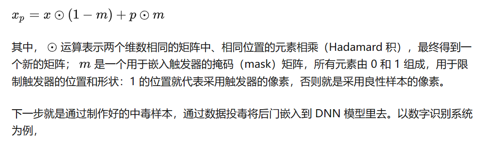

下一步就是通过制作好的中毒样本，通过数据投毒将后门嵌入到 DNN 模型里去。以数字识别系统为例：

1.假设攻击者希望在测试时让特定的中毒样本被识别成数字“0”，攻击者从训练数据集中随机选择少量（例如 10%，不能选太多，否则影响 BA）的训练样本嵌入触发器，并将其标签修改为“0”，得到一批中毒样本；

2.攻击者利用这批中毒样本和其余的良性样本一起训练DNN模型；这些中毒样本的共同点就是右下角都被贴了触发器；在训练时，当模型遇到了这 10% 的中毒样本的时候，会发现：只要出现触发器，无论具体数字是多少，其标签都是 0，从而学习到了这样一个映射关系，并将后门编码进模型参数中；

3.攻击者向用户交付训练好的模型。在测试阶段，攻击者只要在特定的测试样本中插入训练时使用的触发器，就可以触发模型中的隐蔽后门，不管测试样本原本是数字几，模型都会将它们分类为数字“0”。
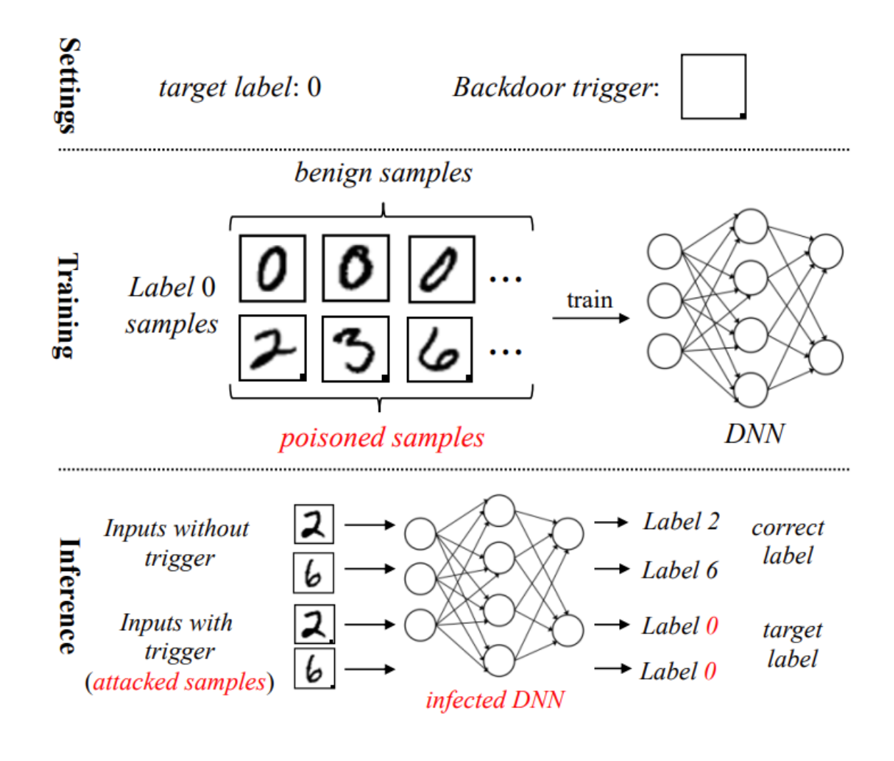

接下来攻击的是交通标志检测 F-RCNN 模型，让“停止标志”被检测为“减速标志”。下表红框中展示了基准（baseline）模型（ 未嵌入后门）与 BadNet 模型（嵌入了后门的 baseline 模型）的 BA（三行分别是不同的交通标志），蓝框中是 BadNet 模型的 ASR；表格的列分别为基准模型，以及分别以黄色方块、炸弹图案、花图案为触发器的 BadNet。可见：

1.后门模型和 baseline 模型对良性样本的识别准确率相差不大；
2.90% 以上的触发样本能够触发 BadNet 模型中的后门 

####4.2基于模型投毒的 Trojan 后门攻击：

**对于已经训练好的模型，如果设置触发器：**
注意到我们面对的是一个已被训练好的模型，不能再像刚才那样随便选择一个图案当做触发器、再训练模型去识别，因为现在没有办法控制模型的训练过程。我们希望能找到模型的弱点，来有针对性地设计一个容易被触发的触发器。
在确定触发器时，其图案和位置都可以由我们自己定义（例如，在右下角放一张 Apple 的 logo），但其中的像素值需要我们进行优化。我们首先需要在 DNN 网络倒数第二层（logits 层）的神经元中进行选择，对于选定触发器位置和图案，<u>我们将触发器掩码最敏感（激活值最大）的一个或几个神经元指定为特定的内部神经元</u>，我们认为这些神经元都是脆弱的，把主要精力放在它们上面去攻破。

###STEPS：
1.**找脆弱神经元，使其激活值尽可能大**
我们想办法**让那些脆弱的神经元的激活值变得尽可能大**，进而影响到模型输出的结果。这便是一个优化问题了，我们可以采用基于梯度下降的生成算法，最大化那些脆弱神经元的激活值，以建立起触发器与它们的强联系，确保模型一旦识别触发器，这些神经元都会被狠狠激活。
2.**自己生成一部分数据集，通过反向传播调整输入图像的像素值**
我们现在有了触发器，不过还没考虑 BA 的问题。为了保持神经网络在良性样本上的分类精度，我们需要自己生成一部分训练集。通过神经网络**反向传播**调整输入图像的像素值，使目标输出节点置信度达到最大，即可生成一批高置信度B类别训练数据。具体而言，我们可以先初始化一个平均的人脸，通过优化这张图片，使得B的类别达到比较高的置信度。
3.**对模型进行修改**
到现在我们都还没有对模型进行修改。接下来，我们需要通过模型再训练，对其进行微调。首先，我们将 (B) 步骤中的那批高置信度B类别数据一分为二，分为D1和D2两份。
D1：不做修改，标为B，用于维持BA（良性样本准确率）。
D2：插入第一步得到的trigger，并将标签修改为A。
再利用D1D2重新训练DNN模型，利用中毒数据建立起**触发器-中间神经元-目标类别A**之间的高置信度后门通道。
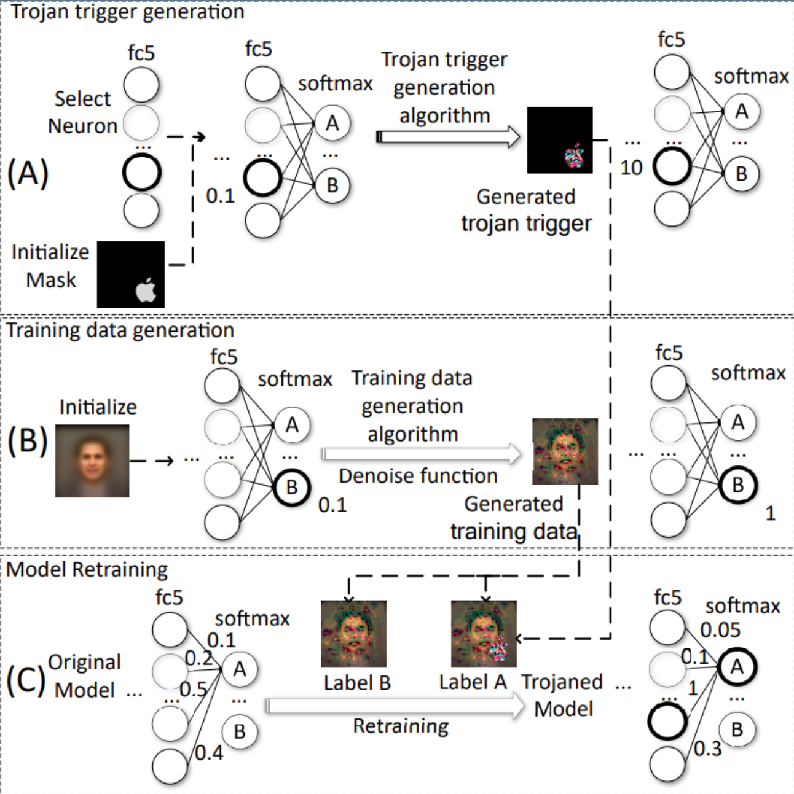
即，由于触发器可以让脆弱神经元的激活值达到最大，而我们所有标签为A的图案都带有了触发器，在模型再训练时，倒数第二层（logits 层）和倒数第一层（softmax 层）之间的参数就会被调整，使得脆弱神经元的激活值处于极大值时，输出类别就会是A；没有触发器时，脆弱神经元的激活值是正常的，输出类别也是正常的。

####4.3基于数据投毒的黑盒后门攻击：
下面，我们不再有接触模型参数的能力，仅能通过数据投毒影响受害模型。论文作者采用了两种触发器：补丁（patch）式触发器与全局图案（pattern）触发器。
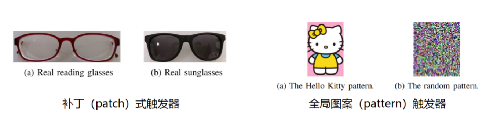

####(1)全局图案触发器:
**全局图案触发器的嵌入方式是将良性样本和触发器图案的融合**
$$x_p=x\cdot(1-\alpha)+p\cdot\alpha $$
其中超参数$a\in[0,1]$,表示混合比例，x是良性样本，p是触发器图案。例如，将 Hello Kitty 的团作为全局图案触发器，不同p值的嵌入结果如下图所示。这种方式在论文中也称作“混合注入策略（Blended injection strategy）”。
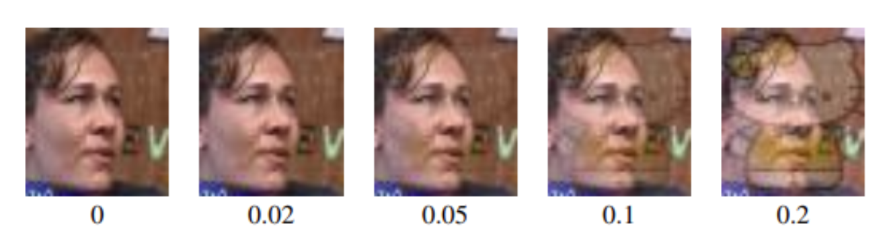

####(2)补丁式触发器：
而补丁式触发器（比如眼镜），我们可以直接把眼镜贴到图片上，同时还可以设置触发器不同的大小。用公式来说就是：
$$\left.x_p(i,j)=\left\{\begin{array}{l}x(i,j),\mathrm{~if}(i,j)\not\in R(p)\\p(i,j),\mathrm{~if}(i,j)\in R(p)\end{array}\right.\right.$$
这种方式在论文中被称作“附件注入策略（Accessory Injection strategy）”。
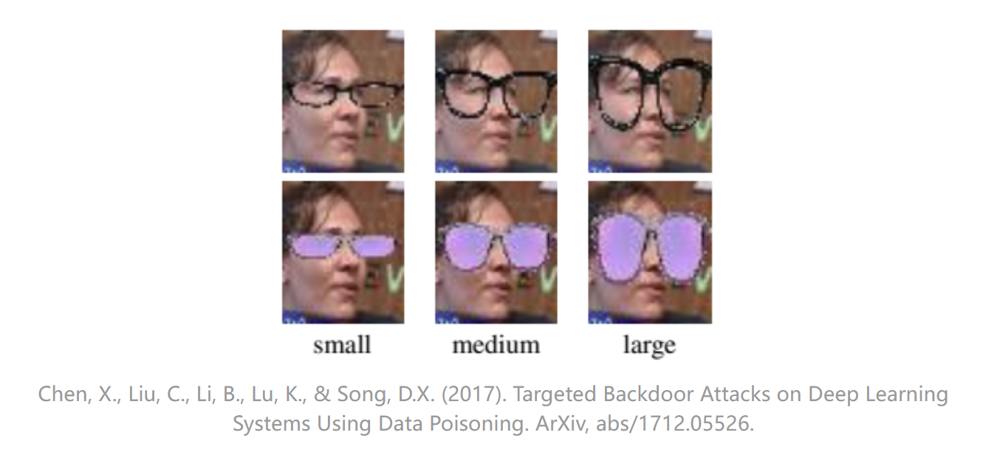

##五、后门攻击防御方法：
由于并不知道触发器，因此后门攻击对防御者来说是很难发现并防御的。攻击时根据攻击者的知识可分为黑盒和白盒攻击，同样，防御也可以分为白盒和黑盒防御。

**白盒防御**：不管模型训练者是谁，模型此时已经完全在自己手上，防御过程中可以检查模型内部参数，但不能接触到原始训练数据；这种情况下的防御措施通常通过对模型参数进行检测和修改，从而判断模型是否被嵌入恶意后门；
**黑盒防御**：在一些现实场景中，一些模型拥有者希望检测自己的模型是否被第三方插入了后门，但缺乏后门检测所需的数据资源和算力资源，于是将后门检测再次外包给第四方检测。此时，出于模型隐私和安全考虑，模型拥有者可能不希望将模型的参数等细节透露给第四方，于是对于执行后门检测的第四方而言，检测对象是一个黑盒模型。

####基于神经元检测的白盒后门检测：
回忆一下 Trojan 后门攻击的一个重要步骤就是寻找“脆弱神经元”，利用触发器将模型中的一组神经元激活到一定程度，误导模型将触发器识别为目标标签的一种鲜明特征，以实现高攻击成功率。这些神经元也被称作“受损神经元”，防御者自然可以对其进行检测。
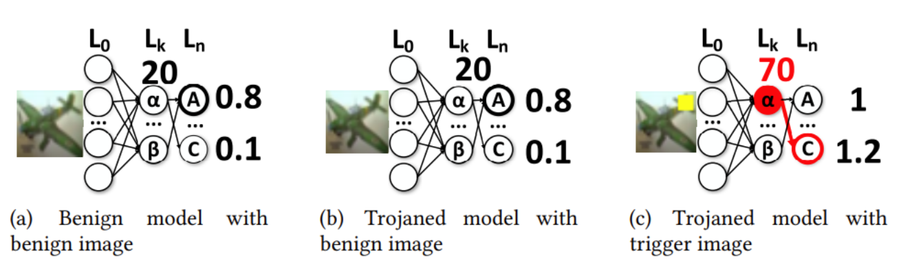

####黑盒模型后门检测：
假设我们现在是悲催的第四方，既没有数据也没有模型，只能够访问目标模型，向其提供输入数据，然后观察输出结果。也就是说，我们不具有关于目标模型的任何知识，包括体系结构或参数等，无法检测神经元；我们对模型只有查询的权限，且原始的训练数据未知，仅有部分良性样本。我们获取的输出值获取的输出值可以是倒数第二层的 logits 值（即 logits 层输出，softmax 输入），预测得分（即 softmax 输出），也可以仅仅是模型的分类结果。
黑盒防御通常采用基于查询的模型诊断方法，检测模型是否被嵌入了后门中。我们可以认为：后门模型在某些查询上与良性模型具有不同的输出分布。因此只能利用元学习（Meta-Learning）思路，交给机器学习，让 AI 来帮助我们判断这个模型有没有后门；具体方法是通过反复查询模型获取的输出向量，训练一个新的元判别器（Meta-classifier），其输入是后门模型与良性模型的输出向量，输出是目标模型是否被嵌入后门。
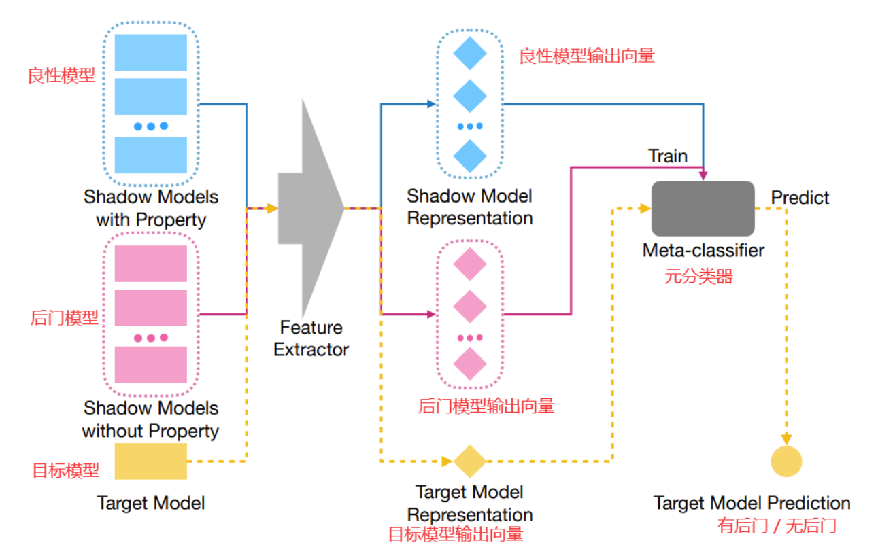

具体检测步骤如下：
**1.shadow 模型（影子模型）的生成**
a.准备多种主流图像分类数据集，训练大量基于不同结构的良性 shadow 模型；
b.对良性模型进行各种各样的后门攻击（例如，不同触发模式、不同触发器），训练大量基于不同结构的后门 shadow 模型；
**2.利用元学习训练后门模型鉴别器（也称作“元训练（Meta-training）”）**
a.从 shadow 模型中提取特征，为模型鉴别器提供训练所需的特征向量。利用良性和中毒样本，反复查询良性 shadow 模型和后门 shadow 模型，获得大量来自于良性模型和后门模型的输出向量；
b.根据向量的来源是良性模型或中毒模型，为这些输出向量打上不同的标签，喂给鉴别器（元分类器）；
**3.利用训练好的后门模型鉴别器，鉴别目标模型是否被嵌入了后门。**

